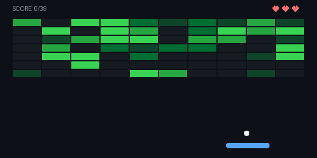
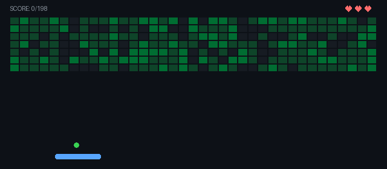
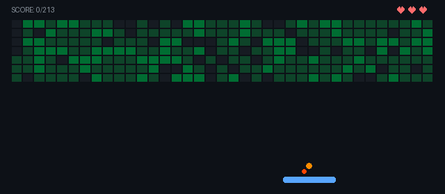
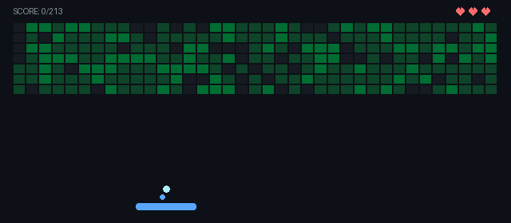
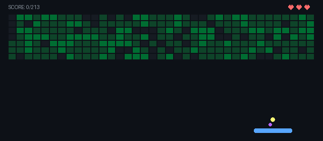
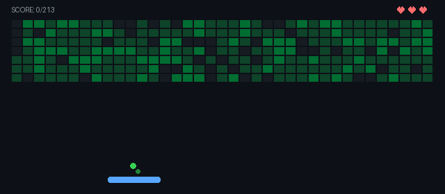
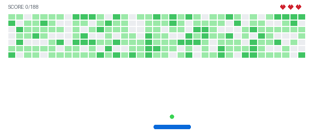

# Commit Brick Breaker

<p align="center">
  
</p>

Turn your GitHub contribution graph into an automated retro Brick Breaker game GIF for your profile README.

[English](#english) • [Bahasa Indonesia](#bahasa-indonesia)

---

## English

### 1. GitHub Profile Integration (Automated)

1. In your GitHub profile repository (`username/username`), create `.github/workflows/brick-breaker.yml`:

```yaml
name: Generate Brick Breaker

on:
  schedule:
    - cron: "0 0 * * *"
  push:
    branches:
      - main
  workflow_dispatch:

jobs:
  build:
    runs-on: ubuntu-latest
    permissions:
      contents: write
    steps:
      - uses: actions/checkout@v4

      - uses: MakdumIbrohim/commit-brick-breaker@main
        with:
          github_token: ${{ secrets.GITHUB_TOKEN }}
          github_user: ${{ github.repository_owner }}
          output_path: game.gif
          ball_skin: classic # classic | fire | ice | lightning | poison
          theme: dark # dark | light

      - name: Commit and Push
        run: |
          git config user.name "github-actions[bot]"
          git config user.email "github-actions[bot]@users.noreply.github.com"
          git add game.gif
          git diff --staged --quiet || git commit -m "chore: update brick breaker game"
          git pull --rebase --autostash origin main || true
          git push
```

#### Ball Skin Options (`ball_skin`)
| Option | Preview |
| :---: | :---: |
| `classic` (default) |  |
| `fire` |  |
| `ice` |  |
| `lightning` |  |
| `poison` |  |

#### Board Theme Options (`theme`)
| Option | Preview |
| :---: | :---: |
| `dark` (default) |  |
| `light` |  |

2. Enable workflow permissions: Repo **Settings** > **Actions** > **General** > **Workflow permissions** > select **Read and write permissions** > **Save**.

3. Add image to your profile `README.md`:
```markdown
<p align="center">
  
</p>
```

### 2. Local Usage (CLI)

```bash
git clone https://github.com/MakdumIbrohim/commit-brick-breaker.git
cd commit-brick-breaker
pip install pillow
python generate.py <username> [output.gif] [skin] [theme]
```

Examples:
```bash
python generate.py MakdumIbrohim game.gif
python generate.py MakdumIbrohim game.gif fire dark
GITHUB_TOKEN="ghp_xxx" python generate.py MakdumIbrohim game.gif ice light
```

---

## Bahasa Indonesia

### 1. Pasang di Profil GitHub (Otomatis)

1. Di repo profil GitHub Anda (`username/username`), buat file `.github/workflows/brick-breaker.yml`:

```yaml
name: Generate Brick Breaker

on:
  schedule:
    - cron: "0 0 * * *"
  push:
    branches:
      - main
  workflow_dispatch:

jobs:
  build:
    runs-on: ubuntu-latest
    permissions:
      contents: write
    steps:
      - uses: actions/checkout@v4

      - uses: MakdumIbrohim/commit-brick-breaker@main
        with:
          github_token: ${{ secrets.GITHUB_TOKEN }}
          github_user: ${{ github.repository_owner }}
          output_path: game.gif
          ball_skin: classic # classic | fire | ice | lightning | poison
          theme: dark # dark | light

      - name: Commit and Push
        run: |
          git config user.name "github-actions[bot]"
          git config user.email "github-actions[bot]@users.noreply.github.com"
          git add game.gif
          git diff --staged --quiet || git commit -m "chore: update brick breaker game"
          git pull --rebase --autostash origin main || true
          git push
```

2. Beri izin write: buka repo **Settings** > **Actions** > **General** > **Workflow permissions** > pilih **Read and write permissions** > **Save**.

3. Tampilkan di `README.md` profil Anda:
```markdown
<p align="center">
  
</p>
```

### 2. Penggunaan di Lokal

```bash
git clone https://github.com/MakdumIbrohim/commit-brick-breaker.git
cd commit-brick-breaker
pip install pillow
python generate.py <username_github> [output_file.gif] [skin] [theme]
```

Contoh pemakaian:
```bash
python generate.py MakdumIbrohim game.gif
python generate.py MakdumIbrohim game.gif fire dark
GITHUB_TOKEN="ghp_xxx" python generate.py MakdumIbrohim game.gif ice light
```
